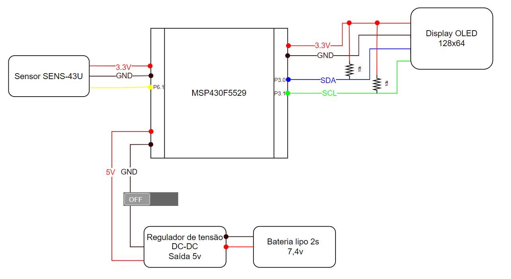

# SISTEMA DE MEDICÃO DE RAIOS ULTRAVIOLETA UTILIZANDO O MICROCONTROLADOR MSP430

## Materiais utilizados

- Microcontrolador MSP430F5529;
- Sensor SENS-43UV - Modulo Ultravioleta Radiação Solar;
- Display OLED 128x64 0.96”I2C - Azul/Amarelo;
- Bateria lipo 2s - 7,4v;
- 5A-HV-UBEC - regulador de tensão DC-DC;
- Resitores de 10kΩ
- Jumper wires;
- Interruptor liga-desliga - flip switch;

## Esquemático

